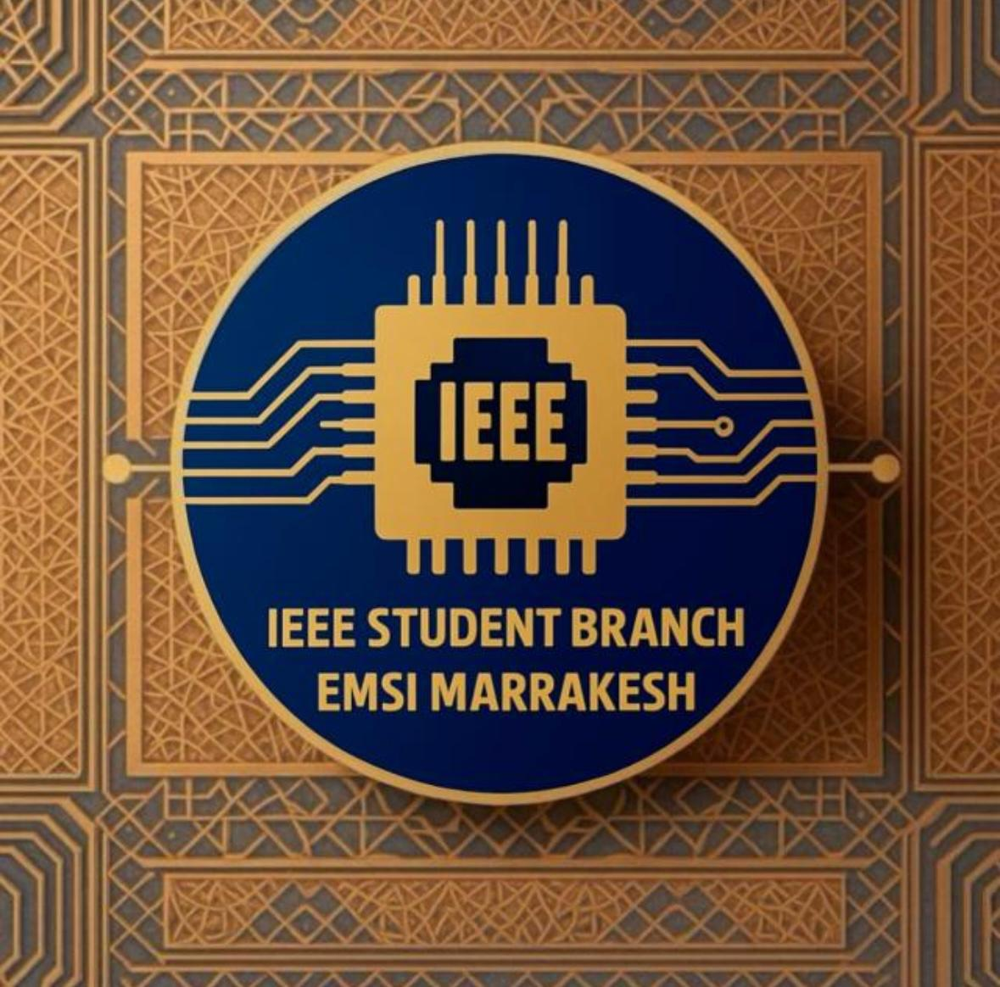

# ⚡ IEEE Student Branch – EMSI Marrakesh

  
  <h1>IEEE S.B EMSI MARRAKESH</h1>

## 👥 Who We Are

We are the **IEEE Student Branch at EMSI Marrakesh**, a community of passionate **students, engineers, and innovators**.  
We focus on **technology, collaboration, and hands-on learning** through real-world and open-source projects.

---

## 🚀 Mission

- 🎯 Develop **technical and leadership skills**  
- 💡 Promote **innovation and research**  
- 🤝 Encourage **collaboration and open-source culture**  
- 🌍 Connect with the global **IEEE network**  

---

## 💡 What We Do

- 🧠 Organize **workshops and hackathons**  
- 💻 Build **technical and open-source projects**  
- 🤝 Collaborate with **IEEE branches and tech communities**  
- 🌐 Participate in **IEEE initiatives**  

---

## 🧭 Get Involved

We welcome **students, mentors, and tech enthusiasts** to join and contribute.

📧 Contact us: [studentbranchiee@gmail.com](mailto:studentbranchiee@gmail.com)  
📸 Follow us on Instagram: [@ieee.emsi.marrakech](https://instagram.com/ieee.emsi.marrakech)  
💼 Connect on LinkedIn: [in/ieeestudentbranchemsimarrakech](https://www.linkedin.com/in/ieeestudentbranchemsimarrakech/)  
🌐 Visit our website: [ieee-sb-emsi-marrakesh.vercel.app](https://ieee-sb-emsi-marrakesh.vercel.app/)  
🌍 Learn more about IEEE: [ieee.org](https://www.ieee.org)  

---

## 🌟 Acknowledgment

Thanks to all **members, volunteers, and mentors** who contribute to the growth of IEEE at EMSI Marrakesh 💙

---

> ⚡ *Advancing Technology for Humanity* — **IEEE Motto**
